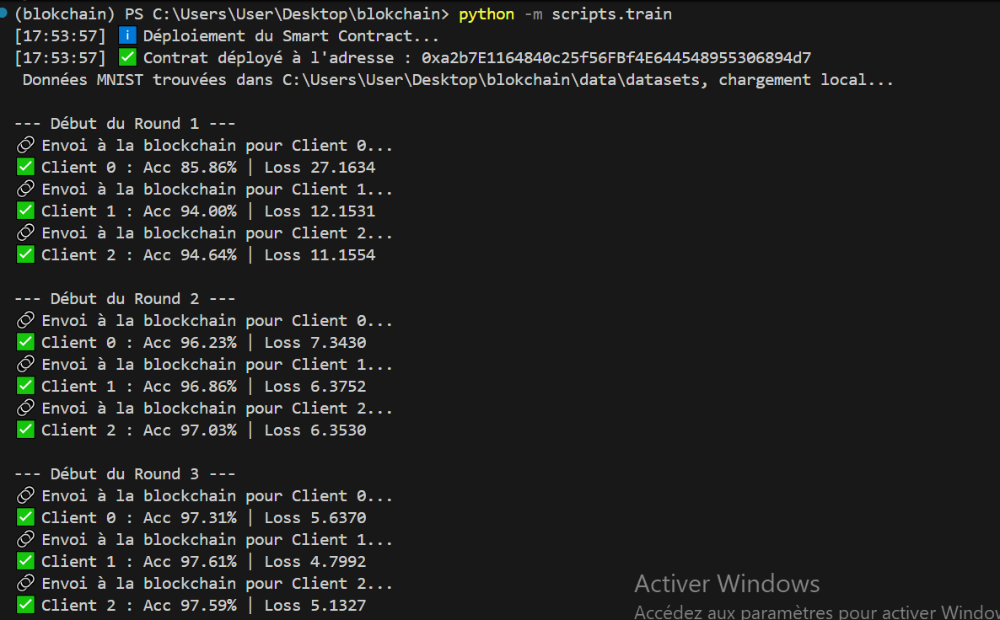
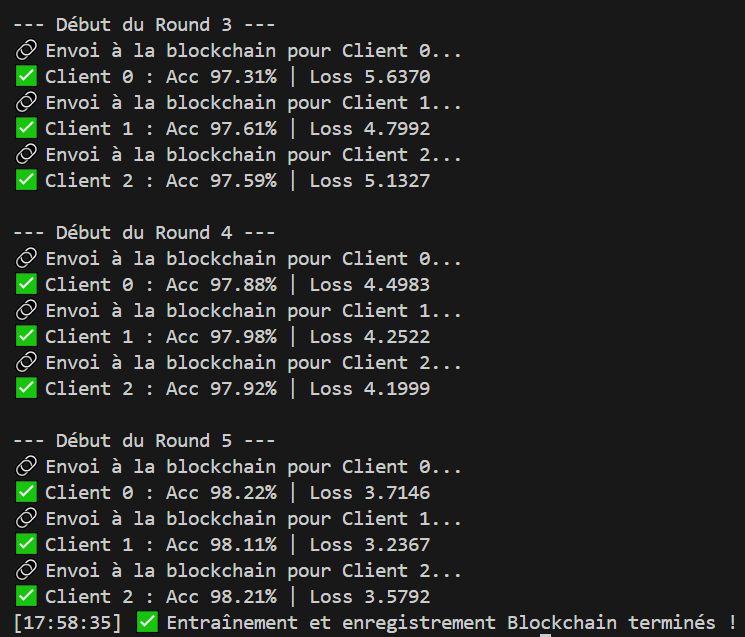
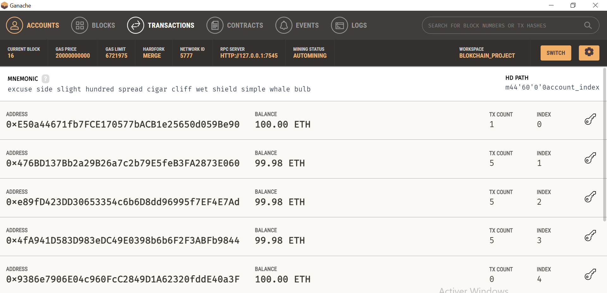
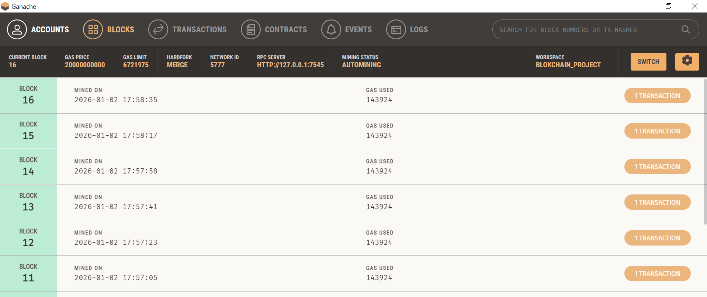
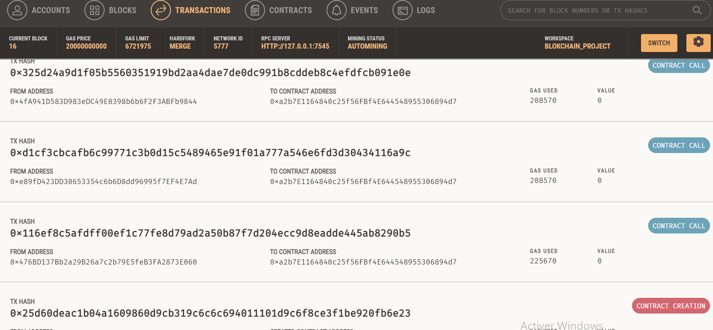
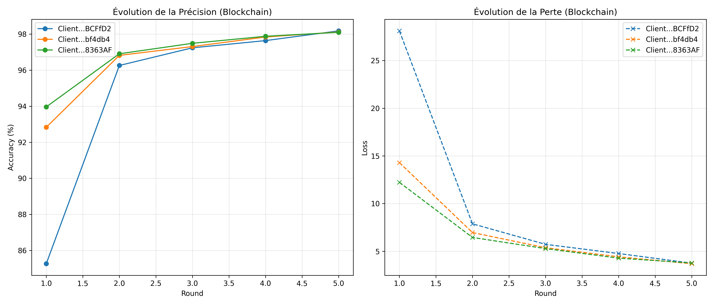

# Split Learning & Blockchain Registry

## Objectif du Projet

Ce Projet vise à démontrer la faisabilité d'une architecture de **Split Learning sécurisée par Blockchain**. Il permet à plusieurs clients (ex : hôpitaux ou institutions) de collaborer pour entraîner un modèle d'IA sans partager leurs données brutes, tout en garantissant la **traçabilité et immuabilité** des preuves d'entraînement grâce à un Smart Contract Ethereum (Ganache).

### Valeur Ajoutée

- **Confidentialité des données** : Les données brutes restent locales sur le client
- **Transparence et confiance** : Chaque round d'entraînement est enregistré sur la blockchain
- **Collaboration multi-parties** : Plusieurs clients peuvent participer simultanément
- **Suivi des performances** : Accuracy et Loss stockés dans la blockchain

## Périmètre Couvert

### Fonctionnalités Implémentées

#### **Split Learning**

- **Client (partie basse du modèle)** : Prétraitement des images (MNIST), génération des *smashed data*
- **Serveur (partie haute du modèle)** : Achève l'inférence, calcule les gradients et renvoie les mises à jour au client
- **Round d'entraînement sécurisé** : Hash SHA-256 des poids locaux avant enregistrement sur blockchain

#### **Blockchain**

- Smart Contract Solidity pour le registre d'entraînement
- Déploiement sur **Ganache GUI**
- Stockage immuable des métriques : Accuracy, Loss, Hash des poids locaux
- Visualisation des résultats via script Python

## Technologies Utilisées

### **Intelligence Artificielle**

- **PyTorch / Torchvision** : Réseaux de neurones pour le split learning
- **Transforms MNIST** : Prétraitement et normalisation des données

### **Blockchain**

- **Web3.py** : Interaction Python avec Ethereum
- **Solidity** : Smart Contract `TrainingRegistry.sol`
- **Ganache** : Blockchain locale pour tests

### **Interface & Scripts**

- Scripts Python pour :
  - Entraînement (`train.py`)
  - Visualisation des métriques (`visualize_results.py`)
    
### **Infrastructure**

- **Python 3.12+**
- **UV** : Gestionnaire de dépendances

## Instructions de Lancement

### **Prérequis**

- Python 3.12+
- Ganache GUI: [Télécharger Ganache](https://trufflesuite.com/ganache/)
- UV (gestionnaire de dépendances Python)

### **Installation Locale**

#### 1. Cloner le projet

```bash
cd split-learning-blockchain
```

#### 2. Installer UV (gestionnaire de dépendances)

```bash
# Windows (PowerShell)
irm https://astral.sh/uv/install.ps1 | iex
```

#### 3. Créer l'environnement virtuel

```bash
uv venv
```

#### 4. Activer l'environnement

```bash
# Windows
.venv\Scripts\activate

# Mac/Linux
source .venv/bin/activate
```

#### 5. Installer les dépendances

```bash
uv sync
```

### **Configuration Ganache**

1. Lancer Ganache GUI
2. Créer un nouveau Workspace Ethereum
3. Vérifier l'URL RPC (par défaut `http://127.0.0.1:7545`)
4. Copier les clés privées des 4 premiers comptes Ganache
5. Les ajouter dans `scripts/train.py` dans la liste `private_keys`

### **Exécution du Projet**

#### Étape 1 : Entraînement et enregistrement

```bash
python -m scripts.train
```

#### Étape 2 : Visualisation Blockchain

```bash
python -m scripts.visualize_results
```

Les graphiques sont sauvegardés automatiquement dans `data/images/`.

## Structure du Projet

```
blockchain/
├── data/
│   ├── datasets/        # Cache MNIST (ignoré par Git)
│   └── images/          # Graphiques générés
├── scripts/
│   ├── train.py         # Orchestrateur (Déploiement + Entraînement)
│   └── visualize_results.py
├── src/
│   └── blockchain/
│       ├── blockchain_code/  # Smart Contract + Web3 Manager
│       ├── core/        # Client, Server, Coordinator
│       ├── models/      # Réseaux de neurones Split
│       ├── data/        # Loader MNIST sécurisé
│       └── utils/       # Logger, crypto, métriques
├── contract_info.json   # Adresse & ABI du contrat
├── pyproject.toml       # Dépendances UV
├── README.md
└── .gitignore
```

## Vision d'Évolution

- Déploiement sur Ethereum Testnet / Mainnet
- Interface web pour suivre les rounds d'entraînement et métriques
- Support multi-client réel pour hôpitaux ou entreprises
- Monitoring et alertes sur la blockchain
- Intégration avec des dashboards (Plotly / Streamlit)

## Métriques de Succès

- Convergence du modèle global (Accuracy)
- Réduction progressive de la Loss
- Traçabilité complète via blockchain
- Confidentialité garantie des données locales

---

#  Rapport d'Analyse des Résultats : IA & Blockchain

Ce document présente les preuves de réussite du projet basées sur les données réelles extraites lors de l'exécution finale. Il démontre la synergie entre l'apprentissage distribué (**Split Learning**) et la certification par **Blockchain**.

##  1. Initialisation et Déploiement

Le terminal confirme que le cycle de vie du projet commence par la sécurisation de l'infrastructure.



**Déploiement du Contrat** : Le Smart Contract `TrainingRegistry` a été déployé avec succès sur Ganache à l'adresse `0xa2b7E1164840c25f56FBf4E644548955306894d7`.

**Optimisation des Données** : Le système a identifié le dataset MNIST local dans `data/datasets`, évitant un téléchargement inutile.

##  2. Performance de l'Entraînement

Les logs de la console montrent une progression constante et harmonisée entre les 3 clients.



**Convergence du Modèle** : La précision (Accuracy) passe de **~85%** au round 1 à **98.2%** au round 5.

**Stabilité de la Perte** : La valeur de la `Loss` diminue de façon régulière pour tous les clients.

**Validation Blockchain** : Chaque étape est suivie de la confirmation : *"Envoi à la blockchain pour Client X..."*.

##  3. Preuves d'Activité sur Ganache (Blockchain)

L'interface de Ganache sert de preuve d'audit pour l'activité du réseau distribué.

### État des Acteurs (Clients)



**Adresses des Clients** : Les adresses comme `0x476...` montrent une activité réelle avec un `TX COUNT` de 5 (un par round).

**Consommation de Gaz** : Les soldes ont légèrement diminué (passant de 100 ETH à ~99.98 ETH), ce qui représente le coût de l'immuabilité.

### Blocs et Transactions



**Blocs minés** : Les blocs ont été générés en temps réel pour enregistrer chaque round d'entraînement.



**Appels de Contrat** : On observe les appels `CONTRACT CALL` vers la fonction `recordTraining` depuis les adresses clients.

##  4. Analyse Graphique Certifiée

Ce graphique est le résultat final, généré **exclusivement** à partir des données extraites du Smart Contract après l'entraînement.



**Précision (Gauche)** : La courbe montre une montée rapide vers 98%, prouvant l'efficacité du Split Learning.

**Perte (Droite)** : La réduction drastique de la perte confirme que le serveur renvoie les bons gradients pour corriger les modèles locaux.

##  5. Conclusion

Les résultats valident l'architecture :

1. **Confidentialité** : Aucune donnée brute n'a été transmise.
2. **Intégrité** : Chaque progrès est auditable sur Ganache.
3. **Performance** : Le modèle atteint **98%+** de précision.

---
